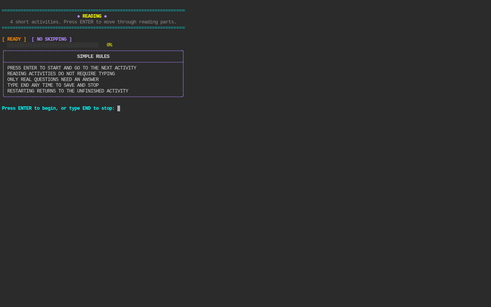
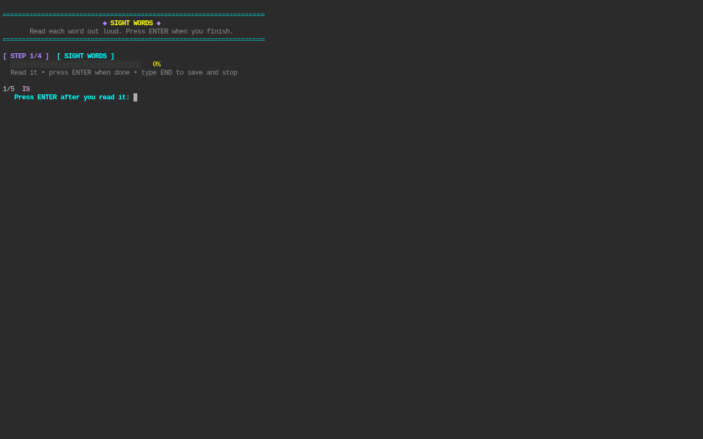
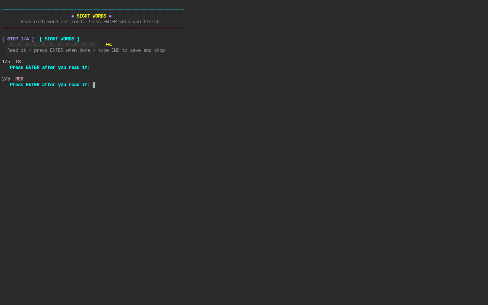

# Reading Terminal Neon

A colorful terminal-based reading practice app for young readers.

## Features

- Easy reading practice
- Sight words
- Reading comprehension
- Simple typing exercises
- No punctuation required for young learners
- Enter-to-continue reading activities
- Multiple lesson choices
- Stars and progress tracking
- End-of-session grades
- Resume unfinished lessons
- Parent controls

## Screenshots

### Main Menu


### Reading


### Activity


### Next Step


## Demo Video

[Watch the demo](media/reading-terminal-demo.mp4)

## Run

```bash
cd ~/Downloads/reading-terminal-neon
chmod +x reading_terminal_neon.py
READING_PARENT_PIN=4826 ./reading_terminal_neon.py
```
