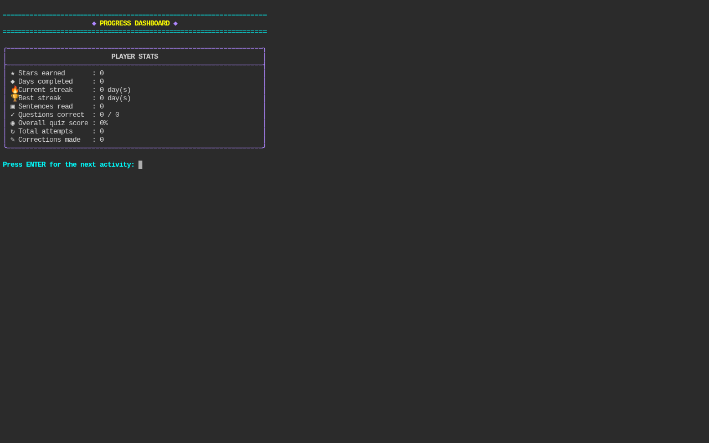
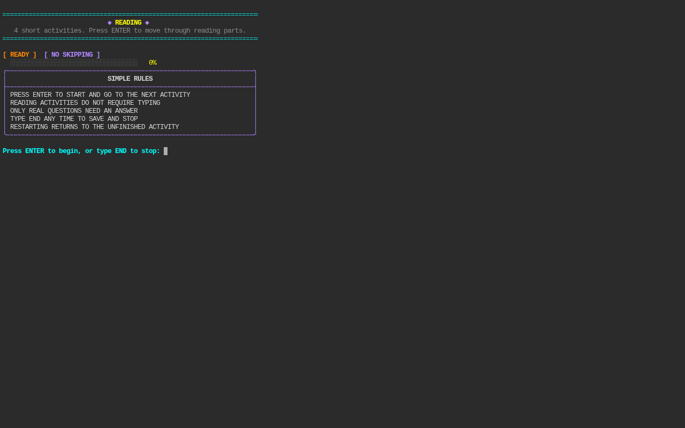
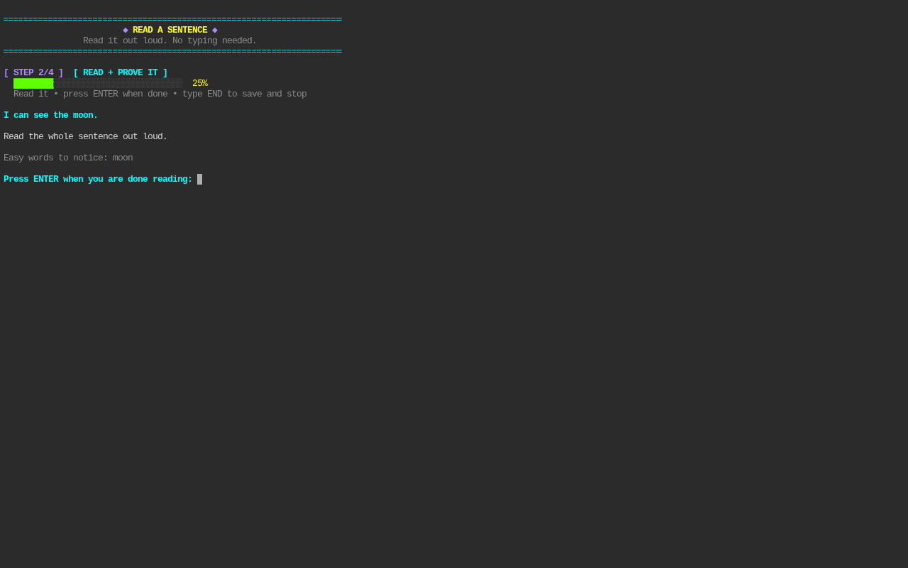

# Reading Terminal Neon

[](https://github.com/iamrichmack111/reading-terminal-neon/actions/workflows/ci.yml)


[](https://github.com/iamrichmack111/reading-terminal-neon/releases)
[](https://github.com/iamrichmack111/reading-terminal-neon/commits/main)
[](https://github.com/iamrichmack111/reading-terminal-neon/wiki)

A colorful terminal-based reading and typing practice app designed for young readers.

## Highlights

- Simple terminal-first interface
- Read-only activities advance with **Enter**
- Easy sentences for early readers
- Child typing does not require punctuation or capitalization where appropriate
- Multiple lesson choices
- Resume unfinished sessions
- Stars, skill mastery, and progress tracking
- End-of-session report card
- Parent controls
- Playwright screenshots and demo video
- GitHub Wiki source included

## Screenshots

### Main Menu


### Progress Dashboard


### Reading Plan


### Sight Word


### Read a Sentence


## Demo Video

▶️ [Watch the Playwright-recorded demo](media/reading-terminal-demo.mp4)

## Run

```bash
chmod +x reading_terminal_neon.py
READING_PARENT_PIN=4826 ./reading_terminal_neon.py
```

## Regenerate screenshots + demo

```bash
./build_reading_terminal_repo.sh
```

## Documentation

The repository includes full Wiki source under [`wiki/`](wiki/). After the GitHub Wiki is initialized, the build script publishes those pages to the repository Wiki.
